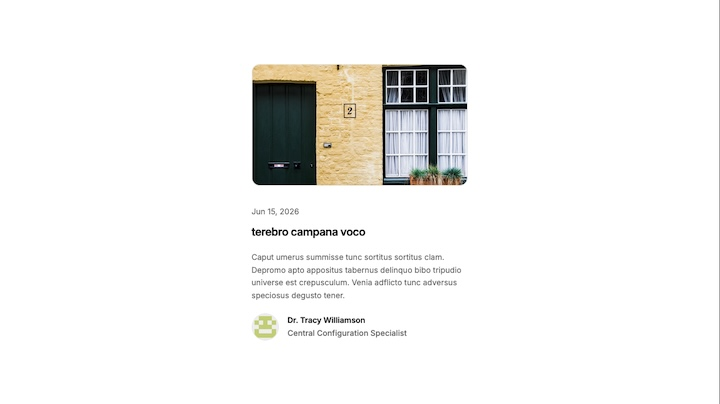

import { LinkButton } from '@astrojs/starlight/components'

Blog-specific components used to display post listings and post headers.

## BlogPostSummary




<LinkButton href="http://localhost:6006/?path=/story/apps-blog-blogpostsummary--summary" variant="secondary" icon="external">Storybook</LinkButton>

**Import**

```js
import { BlogPostSummary } from '@/blog/components/blog-post-summary'
```

**Usage - `summary` variant**

```jsx
<BlogPostSummary
  variant="summary"
  title="My first post"
  description="A short summary of what the post is about."
  date={new Date("2026-06-01")}
  imgSrc="/cover.jpg"
  author={{
    name: "Jane Doe",
    role: "Engineer",
    imageSrc: "https://example.com/avatar.jpg",
    url: "https://example.com",
  }}
/>
```

**Usage - `header` variant**

```jsx
<BlogPostSummary
  variant="header"
  title="My first post"
  date={new Date("2026-06-01")}
  imgSrc="/cover.jpg"
  author={{
    name: "Jane Doe",
    role: "Engineer",
  }}
/>
```

## BlogPostsList


<LinkButton href="http://localhost:6006/?path=/story/apps-blog-blogpostslist--default" variant="secondary" icon="external">Storybook</LinkButton>

**Import**

```js
import { BlogPostsList } from '@/blog/components/blog-posts-list'
```

**Usage**

```jsx
import { BlogPostsList } from '@/blog/components/blog-posts-list'
import { getBlogPostFrontmatters } from '@/blog/utils'
import { postModules } from '@/blog/post-modules'

const posts = getBlogPostFrontmatters(postModules)

<BlogPostsList posts={posts} />
```
