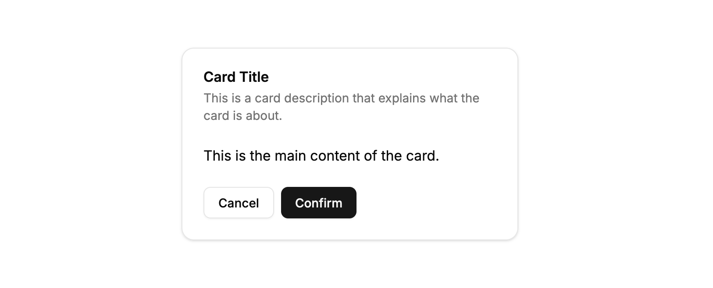
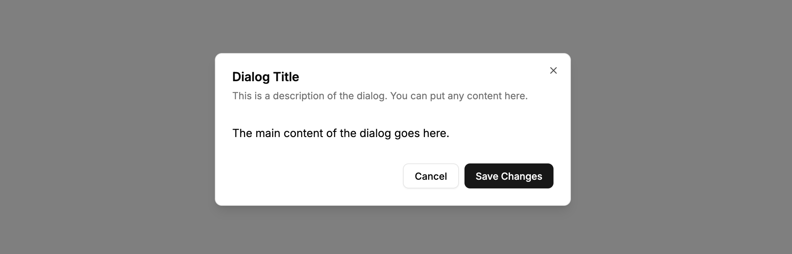
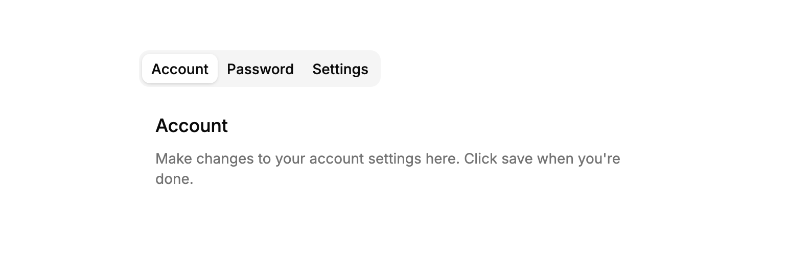
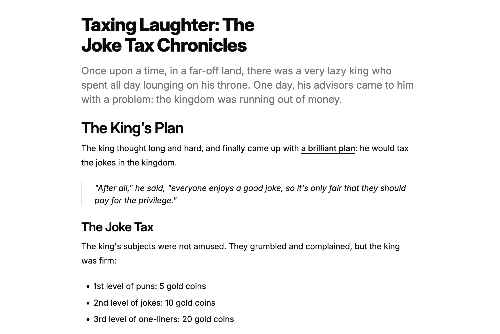
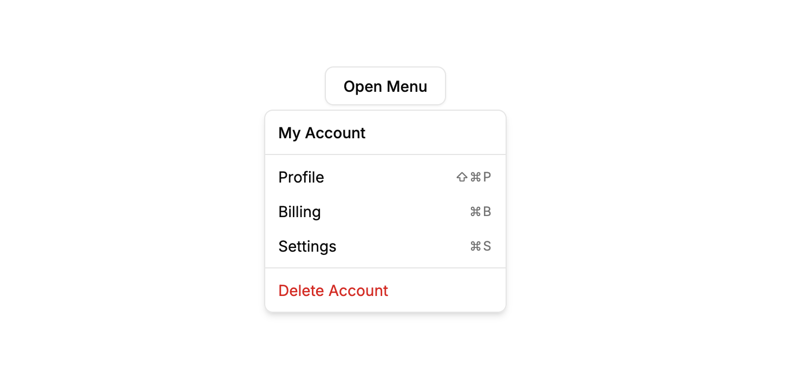

import PowerUpAside from '@/components/powerup-aside.astro'
import { LinkButton } from '@astrojs/starlight/components'

<PowerUpAside />

Essential UI components from [shadcn/ui](https://ui.shadcn.com/), a collection of re-usable components built with Radix UI and Tailwind CSS.

## Button


<LinkButton href="http://localhost:6006/?path=/story/packages-ui-button--primary" variant="secondary" icon="external">Storybook</LinkButton>

**Import**

```js
import { Button } from '@/ui/button'
```

**Usage**

```js
<Button>Button</Button>
```

## Input


<LinkButton href="http://localhost:6006/?path=/story/packages-ui-input--default" variant="secondary" icon="external">Storybook</LinkButton>

**Import**

```js
import { Input } from '@/ui/input'
```

**Usage**

```js
<Input placeholder="Enter text..." />
```

## Link


<LinkButton href="http://localhost:6006/?path=/story/packages-ui-link--default" variant="secondary" icon="external">Storybook</LinkButton>

**Import**

```js
import { Link } from '@/ui/link'
```

**Usage**

```js
<Link href="/" size="default">Link</Link>
```

## Badge


<LinkButton href="http://localhost:6006/?path=/story/packages-ui-badge--default" variant="secondary" icon="external">Storybook</LinkButton>

**Import**

```js
import { Badge } from '@/ui/badge'
```

**Usage**

```js
<Badge>Badge</Badge>
```

## Card



<LinkButton href="http://localhost:6006/?path=/story/packages-ui-card--default" variant="secondary" icon="external">Storybook</LinkButton>

**Import**

```js
import { Card, CardHeader, CardTitle, CardDescription, CardContent, CardFooter } from '@/ui/card'
import { Button } from '@/ui/button'
```

**Usage**

```js
<Card>
  <CardHeader>
    <CardTitle>Card Title</CardTitle>
    <CardDescription>
      This is a card description that explains what the card is about.
    </CardDescription>
  </CardHeader>
  <CardContent>
    <p>This is the main content of the card.</p>
  </CardContent>
  <CardFooter>
    <Button variant="outline">Cancel</Button>
    <Button>Confirm</Button>
  </CardFooter>
</Card>
```

## Alert


<LinkButton href="http://localhost:6006/?path=/story/packages-ui-alert--default" variant="secondary" icon="external">Storybook</LinkButton>

**Import**

```js
import { Alert, AlertTitle, AlertDescription } from '@/ui/alert'
```

**Usage**

```js
<Alert>
  <AlertTitle>Alert Title</AlertTitle>
  <AlertDescription>This is a default alert.</AlertDescription>
</Alert>
```

## Checkbox


<LinkButton href="http://localhost:6006/?path=/story/packages-ui-checkbox--default" variant="secondary" icon="external">Storybook</LinkButton>

**Import**

```js
import { Checkbox } from '@/ui/checkbox'
import { Label } from '@/ui/label'
```

**Usage**

```js
<div className="flex items-center space-x-2">
  <Checkbox id="default" />
  <Label htmlFor="default">Default checkbox</Label>
</div>
```

## Dialog



<LinkButton href="http://localhost:6006/?path=/story/packages-ui-dialog--default" variant="secondary" icon="external">Storybook</LinkButton>

**Import**

```js
import { Dialog, DialogTrigger, DialogContent, DialogHeader, DialogTitle, DialogDescription, DialogFooter } from '@/ui/dialog'
import { Button } from '@/ui/button'
```

**Usage**

```js
<Dialog>
  <DialogTrigger asChild>
    <Button variant="outline">Open Dialog</Button>
  </DialogTrigger>
  <DialogContent>
    <DialogHeader>
      <DialogTitle>Dialog Title</DialogTitle>
      <DialogDescription>
        This is a description of the dialog. You can put any content here.
      </DialogDescription>
    </DialogHeader>
    <p className="py-4">The main content of the dialog goes here.</p>
    <DialogFooter>
      <Button variant="outline">Cancel</Button>
      <Button>Save Changes</Button>
    </DialogFooter>
  </DialogContent>
</Dialog>
```

## Label


<LinkButton href="http://localhost:6006/?path=/story/packages-ui-label--with-checkbox" variant="secondary" icon="external">Storybook</LinkButton>

**Import**

```js
import { Label } from '@/ui/label'
import { Checkbox } from '@/ui/checkbox'
```

**Usage**

```js
<div className="flex items-center space-x-2">
    <Checkbox id="with-label" />
    <Label htmlFor="with-label">Label with Checkbox</Label>
</div>
```

## Tabs



<LinkButton href="http://localhost:6006/?path=/story/packages-ui-tabs--default" variant="secondary" icon="external">Storybook</LinkButton>

**Import**

```js
import { Tabs, TabsList, TabsTrigger, TabsContent } from '@/ui/tabs'
```

**Usage**

```js
<Tabs defaultValue="account">
  <TabsList>
    <TabsTrigger value="account">Account</TabsTrigger>
    <TabsTrigger value="password">Password</TabsTrigger>
    <TabsTrigger value="settings">Settings</TabsTrigger>
  </TabsList>
  <TabsContent value="account" className="p-4">
    <h3 className="font-medium text-lg">Account</h3>
    <p className="mt-2 text-muted-foreground text-sm">
      Make changes to your account settings here. Click save when you're done.
    </p>
  </TabsContent>
  <TabsContent value="password" className="p-4">
    <h3 className="font-medium text-lg">Password</h3>
    <p className="mt-2 text-muted-foreground text-sm">
      Change your password here. After saving, you'll be logged out.
    </p>
  </TabsContent>
  <TabsContent value="settings" className="p-4">
    <h3 className="font-medium text-lg">Settings</h3>
    <p className="mt-2 text-muted-foreground text-sm">
      Manage your account settings and set email preferences.
    </p>
  </TabsContent>
</Tabs>
```

## Typography



<LinkButton href="http://localhost:6006/?path=/story/packages-ui-typography--typography-demo" variant="secondary" icon="external">Storybook</LinkButton>

**Import**

```js
import { Heading, P, Lead, Blockquote, List, Table, TableHeader, TableRow, TableHead, TableBody, TableCell } from '@/ui/typography'
```

**Usage**

```js
<div>
  <Heading level={1}>Taxing Laughter: The Joke Tax Chronicles</Heading>
  <Lead>
    Once upon a time, in a far-off land, there was a very lazy king who
    spent all day lounging on his throne. One day, his advisors came to him
    with a problem: the kingdom was running out of money.
  </Lead>
  <Heading level={2}>The King's Plan</Heading>
  <P>
    The king thought long and hard, and finally came up with{" "}
    <a
      href="https://example.com"
      className="font-medium text-primary underline underline-offset-4"
    >
      a brilliant plan
    </a>
    : he would tax the jokes in the kingdom.
  </P>
  <Blockquote>
    "After all," he said, "everyone enjoys a good joke, so it's only fair
    that they should pay for the privilege."
  </Blockquote>
  <Heading level={3}>The Joke Tax</Heading>
  <P>
    The king's subjects were not amused. They grumbled and complained, but
    the king was firm:
  </P>
  <List>
    <li>1st level of puns: 5 gold coins</li>
    <li>2nd level of jokes: 10 gold coins</li>
    <li>3rd level of one-liners: 20 gold coins</li>
  </List>
</div>
```

## Dropdown Menu



<LinkButton href="http://localhost:6006/?path=/story/packages-ui-dropdownmenu--default" variant="secondary" icon="external">Storybook</LinkButton>

**Import**

```js
import { DropdownMenu, DropdownMenuTrigger, DropdownMenuContent, DropdownMenuLabel, DropdownMenuSeparator, DropdownMenuGroup, DropdownMenuItem, DropdownMenuShortcut } from '@/ui/dropdown-menu'
import { Button } from '@/ui/button'
```

**Usage**

```js
<DropdownMenu>
  <DropdownMenuTrigger asChild>
    <Button variant="outline">Open Menu</Button>
  </DropdownMenuTrigger>
  <DropdownMenuContent className="w-56">
    <DropdownMenuLabel>My Account</DropdownMenuLabel>
    <DropdownMenuSeparator />
    <DropdownMenuGroup>
      <DropdownMenuItem>
        Profile
        <DropdownMenuShortcut>⇧⌘P</DropdownMenuShortcut>
      </DropdownMenuItem>
      <DropdownMenuItem>
        Billing
        <DropdownMenuShortcut>⌘B</DropdownMenuShortcut>
      </DropdownMenuItem>
      <DropdownMenuItem>
        Settings
        <DropdownMenuShortcut>⌘S</DropdownMenuShortcut>
      </DropdownMenuItem>
    </DropdownMenuGroup>
    <DropdownMenuSeparator />
    <DropdownMenuItem variant="destructive">
      Delete Account
    </DropdownMenuItem>
  </DropdownMenuContent>
</DropdownMenu>
```

## Radio Group


<LinkButton href="http://localhost:6006/?path=/story/packages-ui-radiogroup--default" variant="secondary" icon="external">Storybook</LinkButton>

**Import**

```js
import { RadioGroup, RadioGroupItem } from '@/ui/radio-group'
import { Label } from '@/ui/label'
```

**Usage**

```js
<RadioGroup defaultValue="option1">
  <div className="flex items-center gap-3">
    <RadioGroupItem value="option1" id="option1" />
    <Label htmlFor="option1">Option 1</Label>
  </div>
  <div className="flex items-center gap-3">
    <RadioGroupItem value="option2" id="option2" />
    <Label htmlFor="option2">Option 2</Label>
  </div>
  <div className="flex items-center gap-3">
    <RadioGroupItem value="option3" id="option3" />
    <Label htmlFor="option3">Option 3</Label>
  </div>
</RadioGroup>
```
