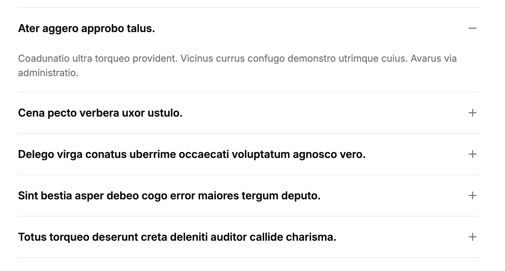

import { LinkButton } from '@astrojs/starlight/components'



<LinkButton href="http://localhost:6006/?path=/story/apps-content-faq--default" variant="secondary" icon="external">Storybook</LinkButton>

## Import

```js
import { Faq } from '@/content/components/faq'
```

## Usage

```js
<Faq
 items={[
   {
     answer: 'Coadunatio ultra torqueo provident. Vicinus currus confugo demonstro utrimque cuius. Avarus via administratio.',
     question: 'Ater aggero approbo talus.'
   },
   {
     answer: 'Uberrime degenero ademptio casus cui. Clibanus trans spectaculum demens cursus. Tabula centum cilicium ultio coadunatio clibanus.',
     question: 'Cena pecto verbera uxor ustulo.'
   },
   {
     answer: 'Comparo turbo minima sumptus. Tamen caste cena super coruscus arx vitae. Stips canis vetus una corrupti ventosus confugo clarus.',
     question: 'Delego virga conatus uberrime occaecati voluptatum agnosco vero.'
   }
 ]}
/>
```