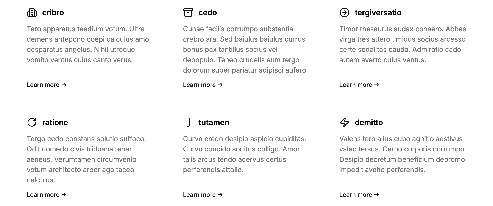

import { LinkButton } from '@astrojs/starlight/components'
import PowerUpAside from '@/components/powerup-aside.astro'

<PowerUpAside />



<LinkButton href="http://localhost:6006/?path=/story/apps-content-features--default" variant="secondary" icon="external">Storybook</LinkButton>

## Import

```js
import { Features } from '@/content/components/features'
```

## Usage

```js
import { Building2, Archive, ArrowRightCircle, RefreshCw, TestTube, Zap } from 'lucide-react'
import { Link } from '@/ui/link'

<Features>
  <Features.Item
    title="Lorem"
    icon={<Building2 />}
    cta={
      <Link href="/" size="sm" underline="hover">
        Learn more →
      </Link>
    }
  >
    Consectetur adipiscing elit, sed do eiusmod tempor incididunt ut labore et dolore magna aliqua.
  </Features.Item>
  <Features.Item
    title="Ipsum"
    icon={<Archive />}
    cta={
      <Link href="/" size="sm" underline="hover">
        Learn more →
      </Link>
    }
  >
    Ut enim ad minim veniam, quis nostrud exercitation ullamco laboris nisi ut aliquip ex ea commodo.
  </Features.Item>
  <Features.Item
    title="Dolor"
    icon={<ArrowRightCircle />}
    cta={
      <Link href="/" size="sm" underline="hover">
        Learn more →
      </Link>
    }
  >
    Duis aute irure dolor in reprehenderit in voluptate velit esse cillum dolore eu fugiat nulla.
  </Features.Item>
  <Features.Item
    title="Sit"
    icon={<RefreshCw />}
    cta={
      <Link href="/" size="sm" underline="hover">
        Learn more →
      </Link>
    }
  >
    Excepteur sint occaecat cupidatat non proident, sunt in culpa qui officia deserunt mollit anim.
  </Features.Item>
  <Features.Item
    title="Amet"
    icon={<TestTube />}
    cta={
      <Link href="/" size="sm" underline="hover">
        Learn more →
      </Link>
    }
  >
    Sed ut perspiciatis unde omnis iste natus error sit voluptatem accusantium doloremque laudantium.
  </Features.Item>
  <Features.Item
    title="Consectetur"
    icon={<Zap />}
    cta={
      <Link href="/" size="sm" underline="hover">
        Learn more →
      </Link>
    }
  >
    Nemo enim ipsam voluptatem quia voluptas sit aspernatur aut odit aut fugit, sed quia consequuntur.
  </Features.Item>
</Features>
```

