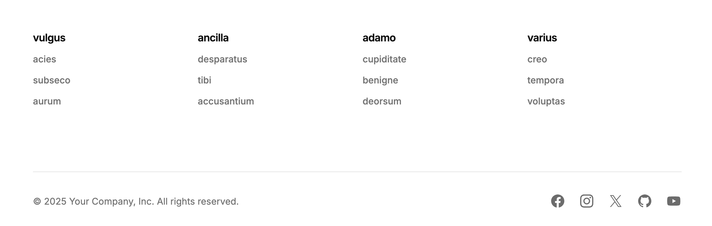

import { LinkButton } from '@astrojs/starlight/components'
import PowerUpAside from '@/components/powerup-aside.astro'

<PowerUpAside />



<LinkButton href="http://localhost:6006/?path=/story/apps-content-footer--default" variant="secondary" icon="external">Storybook</LinkButton>

## Import

```js
import { Footer } from '@/content/components/footer'
```

## Usage

```js
<Footer
  navigation={[
    {
      heading: 'Lorem',
      children: [
        { label: 'Ipsum', href: '/' },
        { label: 'Dolor', href: '/' },
        { label: 'Sit', href: '/' }
      ]
    },
    {
      heading: 'Amet',
      children: [
        { label: 'Consectetur', href: '/' },
        { label: 'Adipiscing', href: '/' },
        { label: 'Elit', href: '/' }
      ]
    },
    {
      heading: 'Sed',
      children: [
        { label: 'Eiusmod', href: '/' },
        { label: 'Tempor', href: '/' },
        { label: 'Incididunt', href: '/' }
      ]
    },
    {
      heading: 'Labore',
      children: [
        { label: 'Dolore', href: '/' },
        { label: 'Magna', href: '/' },
        { label: 'Aliqua', href: '/' }
      ]
    }
  ]}
  socialMediaUrls={{
    facebookUrl: 'https://www.facebook.com',
    instagramUrl: 'https://www.instagram.com',
    twitterUrl: 'https://www.twitter.com',
    githubUrl: 'https://www.github.com',
    youtubeUrl: 'https://www.youtube.com'
  }}
/>
```

