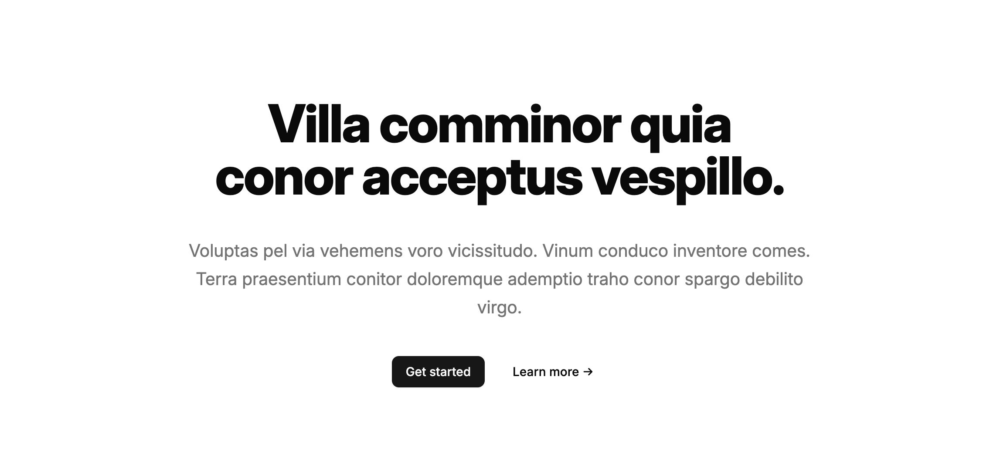

## Import

```js
import { Hero } from '@/content/components/hero'
```

## Usage

```js
import { Button } from '@/ui/button'

<Hero
  title="Lorem ipsum dolor sit amet"
  description="Consectetur adipiscing elit, sed do eiusmod tempor incididunt ut labore et dolore magna aliqua. Ut enim ad minim veniam, quis nostrud exercitation ullamco laboris."
  cta={
    <>
      <Button asChild>
        <a href="/">Get started</a>
      </Button>
      <Button asChild variant="ghost">
        <a href="/">Learn more →</a>
      </Button>
    </>
  }
/>
```

