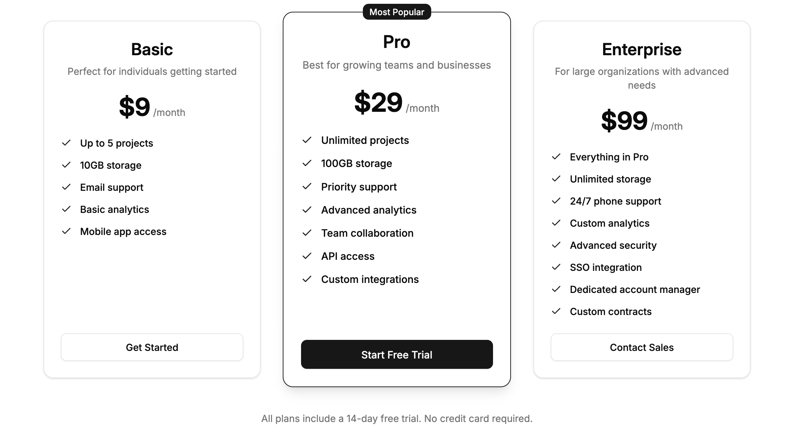

## Import

```js
import { Pricing } from '@/payments/components/pricing'
```

## Usage

```js
import { Button } from '@/ui/button'

<Pricing>
  <Pricing.Plan
    name="Lorem"
    price="$9"
    period="/month"
    description="Ipsum dolor sit amet consectetur"
    features={[
      'Lorem ipsum dolor',
      'Sit amet consectetur',
      'Adipiscing elit sed',
      'Do eiusmod tempor',
      'Incididunt ut labore',
    ]}
    cta={
      <Button className="w-full" variant="outline" size="lg">
        Lorem Ipsum
      </Button>
    }
  />

  <Pricing.Plan
    name="Dolor"
    price="$29"
    period="/month"
    description="Sit amet consectetur adipiscing"
    features={[
      'Consectetur adipiscing',
      'Elit sed do eiusmod',
      'Tempor incididunt ut',
      'Labore et dolore magna',
      'Aliqua ut enim ad',
      'Minim veniam quis',
      'Nostrud exercitation',
    ]}
    popular
    cta={
      <Button className="w-full" variant="default" size="lg">
        Dolor Sit
      </Button>
    }
  />

  <Pricing.Plan
    name="Amet"
    price="$99"
    period="/month"
    description="Consectetur adipiscing elit sed do"
    features={[
      'Ullamco laboris nisi',
      'Ut aliquip ex ea',
      'Commodo consequat duis',
      'Aute irure dolor in',
      'Reprehenderit voluptate',
      'Velit esse cillum',
      'Dolore eu fugiat',
      'Nulla pariatur excepteur',
    ]}
    cta={
      <Button className="w-full" variant="outline" size="lg">
        Consectetur
      </Button>
    }
  />
</Pricing>
```

