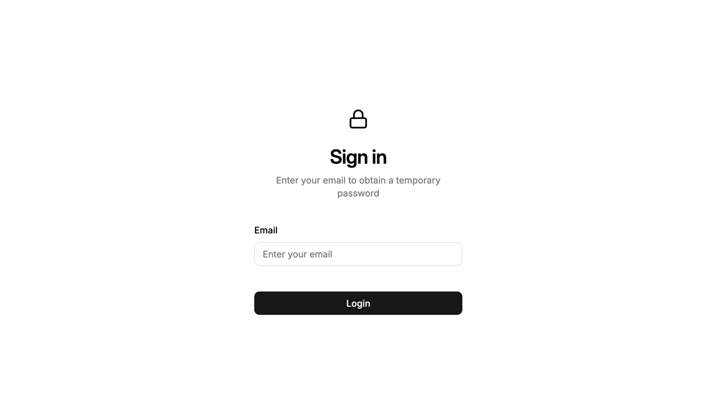

import { LinkButton } from '@astrojs/starlight/components'



<LinkButton href="http://localhost:6006/?path=/story/apps-user-signin--default" variant="secondary" icon="external">Storybook</LinkButton>

## Import

```js
import { SignIn } from '@/auth/components/sign-in'
```

## Usage

```js
<SignIn
  email={email}
  error={error}
  success={success}
  signature={signature}
  expiresAt={expiresAt}
/>
```

