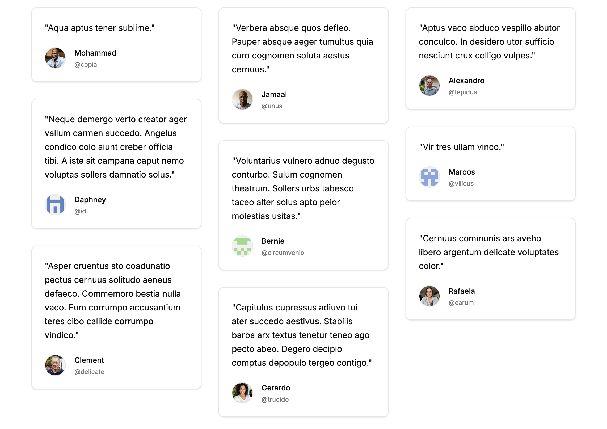

import { LinkButton } from '@astrojs/starlight/components'
import PowerUpAside from '@/components/powerup-aside.astro'

<PowerUpAside />



<LinkButton href="http://localhost:6006/?path=/story/apps-content-testimonials--default" variant="secondary" icon="external">Storybook</LinkButton>

## Import

```js
import { Testimonials } from '@/content/components/testimonials'
```

## Usage

```js
<Testimonials
  items={[
    {
      quote: 'Lorem ipsum dolor sit amet, consectetur adipiscing elit. Sed do eiusmod tempor incididunt ut labore.',
      url: 'https://example.com',
      author: {
        name: 'Lorem Ipsum',
        imageSrc: 'https://i.pravatar.cc/150?img=1',
        id: 'lorem'
      }
    },
    {
      quote: 'Ut enim ad minim veniam, quis nostrud exercitation ullamco laboris nisi ut aliquip ex ea commodo.',
      url: 'https://example.com',
      author: {
        name: 'Dolor Sit',
        imageSrc: 'https://i.pravatar.cc/150?img=2',
        id: 'dolor'
      }
    },
    {
      quote: 'Duis aute irure dolor in reprehenderit in voluptate velit esse cillum dolore eu fugiat nulla.',
      url: 'https://example.com',
      author: {
        name: 'Amet Consectetur',
        imageSrc: 'https://i.pravatar.cc/150?img=3',
        id: 'amet'
      }
    }
  ]}
/>
```

