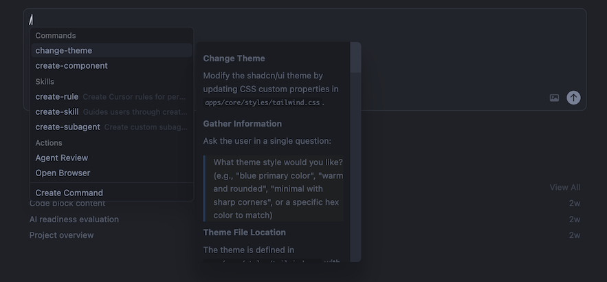

import PowerUpAside from '@/components/powerup-aside.astro';
import { FileTree } from '@astrojs/starlight/components';

PageZERO architecture is designed from the ground up for AI-assisted development. Every structure, pattern, and convention exists to help AI coding assistants like Cursor, Copilot, and Claude understand, navigate, and modify code effectively.

**Why this matters?**

Codebase gives you a well-defined foundation that scales. When AI agents work with PageZERO:

1. They read `AGENTS.md` and immediately understand the entire architecture
2. They follow documented patterns with confidence
3. They generate code that matches your codebase style — every time

The result: faster iterations, fewer errors, and a codebase that gets better as AI tools improve.

## Predictable Structure

The codebase follows a consistent, modular architecture:

<FileTree>

- apps/ Feature modules (auth, payments, user, etc.)
  - feature/
    - index.ts Public exports
    - components/ Feature-specific components
    - routes/ Route handlers
    - db/ Database schema (if needed)
- packages/ Shared, reusable code
  - ui/ UI component library
  - db/ Database utilities
  - types/ Shared TypeScript types

</FileTree>

Each feature module is self-contained. AI agents can add new features by following existing module patterns and find related code in predictable locations.

## Consistent Patterns

**Component structure.** Every UI component follows the same four-file pattern:

<FileTree>

- component-name/
  - index.ts Re-exports public API
  - component-name.tsx Implementation
  - component-name.test.tsx Unit tests
  - component-name.stories.tsx Storybook stories

</FileTree>

**Code generation.** The built-in generator creates scaffolds that follow project conventions:

```bash
bun run generate component MyComponent packages/ui
```

**Strict TypeScript.** Explicit types throughout—component props, route loaders, database schema. AI agents understand function signatures without reading implementations.

**TailwindCSS & shadcn/ui.** AI models are extensively trained on Tailwind and shadcn patterns. The UI library uses familiar conventions—utility classes, `cva` for variants, Radix primitives—that AI assistants recognize and generate correctly out of the box.

**Auto-formatting & linting.** Biome handles both formatting and linting. AI-generated code gets normalized and checked automatically.

## AGENTS.md

<PowerUpAside />

The project includes an `AGENTS.md` file at the root—a comprehensive guide written specifically for AI coding agents:

- **Project overview** — tech stack, architecture, and directory structure
- **Coding conventions** — TypeScript patterns, file naming, component structure
- **Step-by-step guides** — how to add features, components, and database tables
- **Scripts reference** — common commands and their usage
- **Key files** — where to find routes, config, schema, and other important files

When an AI agent opens the project, it reads `AGENTS.md` and immediately understands how to write code that matches your codebase style.

## Cursor Commands

<PowerUpAside />

The project includes useful custom Cursor commands in `.cursor/commands/` folder. These are reusable AI workflows for common tasks:

| Command | Description |
|---------|-------------|
| `create-component` | Creates a new UI component with all four files (implementation, index, test, stories) following PageZERO conventions |
| `change-theme` | Modifies the shadcn/ui theme by updating CSS custom properties in OKLCH color space |

**How to use them:**

1. In Cursor, open a new AI agent chat (⌘+Shift+L or Ctrl+Shift+L)
2. Type: `/`
3. Select the command you want to run
4. Follow the prompts in the chat

Each command guides the AI through a structured workflow - gathering requirements, following project conventions, and generating consistent code.


