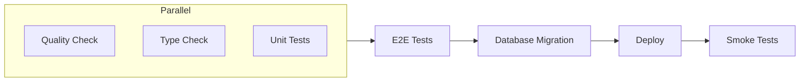

**CI/CD** (Continuous Integration / Continuous Deployment) automates testing and deployment of your code. When you push changes, the pipeline automatically runs quality checks, tests, and deploys to production—no manual steps required.

PageZERO includes a pre-configured pipeline using **GitHub Actions** and **Cloudflare Workers**.

**How it works**

1. You push code to GitHub
2. Pipeline runs linting, type checking, and unit tests in parallel
3. E2E tests verify the app works end-to-end
4. Database migrations run automatically
5. Code deploys to Cloudflare Workers
6. Smoke tests verify the deployment succeeded

**Pipeline Overview**

**Environments**

| Branch | Environment | Database | URL |
|--------|-------------|----------|-----|
| `main` | Production | Production D1 | Your custom domain |
| PR branches | Preview | Preview D1 | `*.workers.dev` |

## Setup

For setup instructions, see the [Automatic deployment](/getting-started/deployment#automatic) section in the deployment guide.

## Preview Database Reset

A separate workflow can reset the preview database to a clean state. Trigger it manually from GitHub Actions when needed:

1. Go to Actions → "Reset preview database"
2. Click "Run workflow"
3. Select the `main` branch

This cleans the database, runs migrations, and seeds with fresh data.
