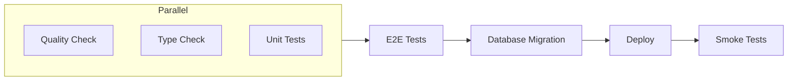

Automated deployment pipeline using **GitHub Actions** and **Cloudflare Workers**. Every push triggers quality checks, tests, and deployments—zero manual steps required.

**Key features**

- Automatic deployments on every push to `main`
- Preview environments for pull requests
- Parallel quality, type, and unit test checks
- E2E tests before deployment
- Smoke tests after deployment
- Database migrations in the pipeline

**Pipeline Overview**

**Environments**

| Branch | Environment | Database | URL |
|--------|-------------|----------|-----|
| `main` | Production | Production D1 | Your custom domain |
| PR branches | Preview | Preview D1 | `*.workers.dev` |

## Setup

For setup instructions, see the [Automatic deployment](/getting-started/deployment#automatic) section in the deployment guide.

## Preview Database Reset

A separate workflow can reset the preview database to a clean state. Trigger it manually from GitHub Actions when needed:

1. Go to Actions → "Reset preview database"
2. Click "Run workflow"
3. Select the `main` branch

This cleans the database, runs migrations, and seeds with fresh data.
