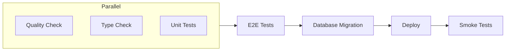

**CI/CD** (Continuous Integration / Continuous Deployment) automates testing and deployment of your code. When you push changes, the pipeline automatically runs quality checks, tests, and deploys to production—no manual steps required.

PageZERO includes a pre-configured pipeline using **GitHub Actions** and **Cloudflare Workers**.

**How it works**

1. You push code to GitHub
2. Pipeline runs linting, type checking, and unit tests in parallel
3. E2E tests verify the app works end-to-end
4. Database migrations run automatically
5. Code deploys to Cloudflare Workers
6. Smoke tests verify the deployment succeeded

**Pipeline Overview**

**Environments**

| Branch | Environment | Database | URL |
|--------|-------------|----------|-----|
| `main` | Production | Production D1 | Your custom domain |
| PR branches | Preview | Preview D1 | `*.workers.dev` |

## Setup

For setup instructions, see the [Automatic deployment](/getting-started/deployment#automatic) section in the deployment guide.

## Protecting Preview URLs (optional)

By default, preview deployments (`*.workers.dev`) are publicly accessible. You can restrict access using [Cloudflare Zero Trust](https://developers.cloudflare.com/cloudflare-one/) so only authorized users can view preview environments.

1. Go to [Cloudflare Zero Trust](https://one.dash.cloudflare.com/) → Access → Applications
2. Create a new [Self-hosted application](https://developers.cloudflare.com/cloudflare-one/applications/configure-apps/self-hosted-public-app/)
3. Set the application domain to your preview URL pattern (e.g., `*.workers.dev`)
4. Configure an [Access policy](https://developers.cloudflare.com/cloudflare-one/policies/access/) to control who can access (e.g., specific email addresses or identity providers)

Once configured, users must authenticate before accessing preview URLs.

## Smoke Tests (optional)

Smoke tests run against the deployed preview URL. If your preview environment is protected by Cloudflare Zero Trust (see above), you'll need to configure service authentication so the pipeline can access it:

1. Create a [Service Token](https://developers.cloudflare.com/cloudflare-one/identity/service-tokens/) in Cloudflare Zero Trust
2. Add a [Service Auth policy](https://developers.cloudflare.com/cloudflare-one/policies/access/#service-auth) to your Access application
3. Add `CLOUDFLARE_ACCESS_CLIENT_ID` as a GitHub Actions variable
4. Add `CLOUDFLARE_ACCESS_CLIENT_SECRET` as a GitHub Actions secret

The pipeline will use these credentials to authenticate smoke test requests against protected preview URLs.

## Preview Database Reset

A separate workflow can reset the preview database to a clean state. Trigger it manually from GitHub Actions when needed:

1. Go to Actions → "Reset preview database"
2. Click "Run workflow"
3. Select the `main` branch

This cleans the database, runs migrations, and seeds with fresh data.
