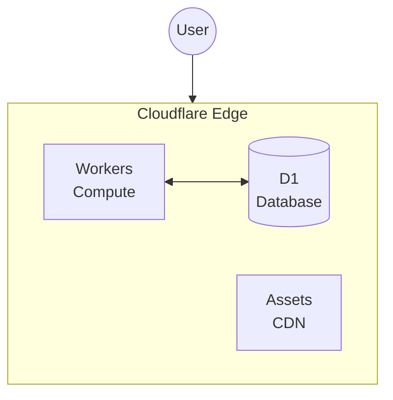

PageZERO is built specifically for **[Cloudflare's](https://www.cloudflare.com/)** edge platform. Your application runs on Cloudflare Workers with data stored in Cloudflare D1-a fully integrated, serverless architecture that scales automatically.

**Key features**

- Edge computing with Cloudflare Workers
- Serverless SQLite database with D1
- Global CDN for static assets
- Bot protection with Turnstile
- Zero cold starts
- Generous free tier

## Architecture

| Component | Purpose | Cloudflare Service |
|-----------|---------|-------------------|
| Compute | Server-side rendering, API routes | [Workers](https://developers.cloudflare.com/workers/) |
| Database | Data persistence | [D1](https://developers.cloudflare.com/d1/) (SQLite) |
| Static files | JS, CSS, images | [Assets](https://developers.cloudflare.com/workers/static-assets/) (CDN) |
| Bot protection | Form spam prevention | [Turnstile](https://developers.cloudflare.com/turnstile/) |

## Why Cloudflare?

**Performance:** Code runs in [300+ data centers](https://www.cloudflare.com/network/) worldwide. Users connect to the nearest edge location, reducing latency significantly compared to traditional hosting.

**Simplicity:** No servers to provision, scale, or maintain. Cloudflare handles infrastructure automatically.

**Cost:** The [free tier](https://developers.cloudflare.com/workers/platform/pricing/) includes 100,000 Worker requests/day and 5GB D1 storage-enough for most projects. You only pay when you scale.

**Integration:** Workers, D1, and Turnstile work together seamlessly. No complex configuration or third-party services needed for core functionality.
