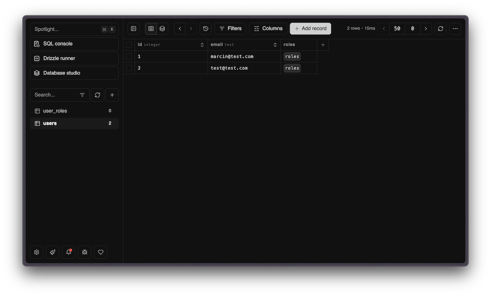

import { Steps, FileTree } from '@astrojs/starlight/components';

Database integration with **[Cloudflare D1](https://developers.cloudflare.com/d1/)** (SQLite) and **[Drizzle ORM](https://orm.drizzle.team/)**. Pre-configured for local development, migrations, and production deployment.

**Key features**

- SQLite database running on Cloudflare's edge
- Type-safe queries with Drizzle ORM
- Automatic migration generation
- Visual database browser with Drizzle Studio
- Separate databases for production and preview

## Database Commands

```bash
bun run db:studio           # Open visual database browser
bun run db:generate         # Generate migrations from schema changes
bun run db:migrate          # Apply migrations locally
bun run db:reset            # Delete all migrations and regenerate from scratch
```

## Accessing the Database

Use `getMainDb()` from `@/db/main` to access the Drizzle ORM instance. Call it inside server functions:

```tsx
import { createServerFn } from "@tanstack/react-start"
import { getMainDb } from "@/db/main"
import { users } from "@/db/main/schema"

const listUsers = createServerFn({ method: "GET" }).handler(async () => {
  const db = getMainDb()
  return db.select().from(users).all()
})
```

The `db` object is a Drizzle ORM instance with full TypeScript support.

## Schema Definition

Database schemas are defined in feature modules and then aggregated at `packages/db/main/`:

<FileTree>

- apps/
  - user/db/schema.ts User tables
  - permissions/db/schema.ts Permission tables
  - payments/db/schema.ts Payment tables
- packages/db/
  - main/
    - schema.ts Main database schema
    - migrations/ Generated SQL migrations

</FileTree>

**Example schema:**

```tsx
import { integer, sqliteTable, text } from "drizzle-orm/sqlite-core"

export const users = sqliteTable("users", {
  id: integer("id").primaryKey(),
  email: text("email").notNull(),
})
```

## Adding a New Table

<Steps>

1. Create or update a schema file in your feature's `db/` folder:

   ```tsx
   // apps/blog/db/schema.ts
   import { integer, sqliteTable, text } from "drizzle-orm/sqlite-core"

   export const posts = sqliteTable("posts", {
     id: integer("id").primaryKey(),
     title: text("title").notNull(),
     content: text("content"),
   })
   ```

1. Generate a migration:

   ```bash
   bun run db:generate
   ```

1. Apply the migration locally:

   ```bash
   bun run db:migrate
   ```

</Steps>

The migration is automatically applied in CI/CD via Wrangler when you push your changes.

## Drizzle Studio

Browse and edit your database visually:

```bash
bun run db:studio
```

Opens at [local.drizzle.studio](https://local.drizzle.studio) where you can:

- View all tables and their data
- Run queries
- Edit records directly
- Explore relationships



