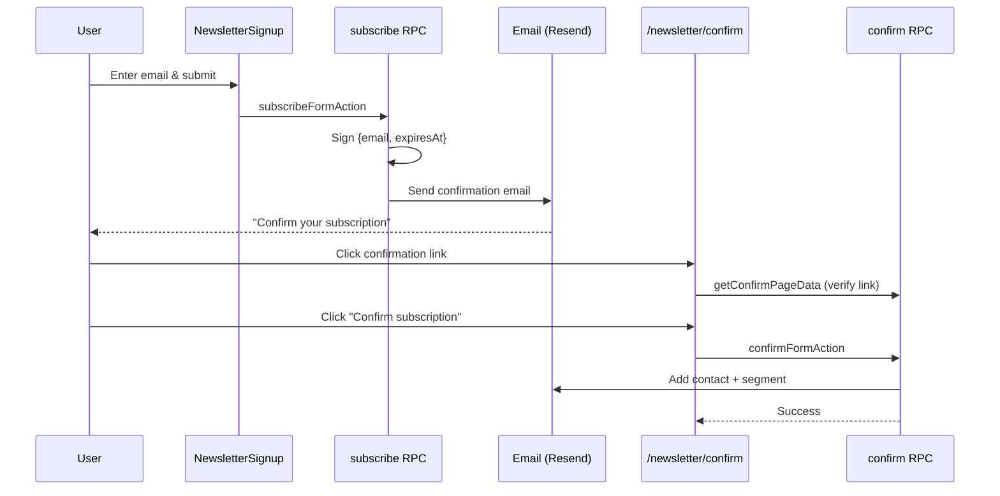

import { Steps } from '@astrojs/starlight/components';

Newsletter subscription powered by **[Resend](https://resend.com/)**. Collect email addresses with a double opt-in flow-subscribers confirm their address before being added to your audience, keeping your list clean and compliant.

**Key features**

- Double opt-in confirmation via email
- Bot protection with Cloudflare Turnstile (optional)
- Signed, expiring confirmation links
- Resend contacts and audience segment integration
- Ready-to-use `NewsletterSignup` form component

## Setup

<Steps>

1. **Resend** - follow the [Email setup](/features/email#setup) guide to create a Resend account, configure your sending domain, and add the `RESEND_API_KEY` secret.

2. **Resend audience segment** - in the Resend dashboard, create an **Audience** and inside it create a **Segment**, then copy the segment ID.

3. **Add the segment ID** - add `NEWSLETTER_SEGMENT_ID` to the `vars` section in `wrangler.json`. Set it at the top level for local development, and override it per environment if you want different segments for production and preview:

   ```json
   {
     "vars": {
       "NEWSLETTER_SEGMENT_ID": "your-dev-segment-id"
     },
     "env": {
       "production": {
         "vars": {
           "NEWSLETTER_SEGMENT_ID": "your-production-segment-id"
         }
       },
       "preview": {
         "vars": {
           "NEWSLETTER_SEGMENT_ID": "your-preview-segment-id"
         }
       }
     }
   }
   ```

   If you only have one segment, you can set it at the top level and omit the per-environment overrides.

</Steps>

Turnstile bot protection is enabled automatically when `CLOUDFLARE_TURNSTILE_SECRET_KEY` is present (see [Cloudflare](/features/cloudflare)).

## NewsletterSignup

Drop the signup form anywhere in your app. It handles Turnstile, form state, loading, and success/error messages internally.

```tsx
import { NewsletterSignup } from "@/newsletter/components/newsletter-signup"

<NewsletterSignup cloudflareTurnstilePublicKey={cloudflareTurnstilePublicKey} />
```

If `cloudflareTurnstilePublicKey` is not provided, bot protection is disabled.

The component is already embedded on the home page. Its public key is loaded via a route loader:

```tsx
// apps/brand/routes/home.tsx
export const Route = createFileRoute("/_brand-layout/")({
  loader: () => getTurnstilePublicKey(),
  component: Index,
})
```

## Subscription Flow

1. User enters their email in the `NewsletterSignup` component
2. If Turnstile is configured, bot verification runs before the request reaches the server
3. The server signs a confirmation payload `{ email, expiresAt }` using `OTP_SECRET` and sends a confirmation email via Resend
4. The user clicks the link in the email and lands on `/newsletter/confirm`
5. The server verifies the link signature and checks it has not expired (30-minute window)
6. The user clicks **Confirm subscription**
7. The server adds the contact to Resend and to the configured segment


