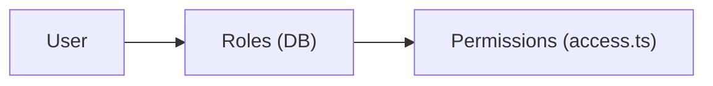

Role-based access control built on **Better Auth's admin plugin**. Roles are stored on the user record; permissions are defined in code via Better Auth access control.

**How it works**



- **Users** are assigned **roles** (stored as a comma-separated `role` field on the Better Auth `user` table)
- **Roles** map to **permissions** (defined in `apps/auth/access.ts`)

Built-in roles:

| Role | Permissions |
|------|-------------|
| `user` | (none beyond default access) |
| `admin` | Better Auth admin statements |
| `premium` | `viewPremium` |
| `elite` | `viewPremium`, `viewElite` |

## Configuration

Define roles and content permissions in `apps/auth/access.ts`:

```ts
import { createAccessControl } from "better-auth/plugins/access"
import { adminAc, defaultStatements } from "better-auth/plugins/admin/access"

const statement = {
  ...defaultStatements,
  content: ["viewPremium", "viewElite"],
} as const

export const ac = createAccessControl(statement)

export const user = ac.newRole({})
export const admin = ac.newRole({ ...adminAc.statements })
export const premium = ac.newRole({ content: ["viewPremium"] })
export const elite = ac.newRole({ content: ["viewPremium", "viewElite"] })
```

These roles are registered on both the Better Auth server (`apps/auth/auth.server.ts`) and client (`apps/auth/auth.ts`).

## API

All functions are exported from `@/auth`.

| Function | Purpose |
|----------|---------|
| `requireUserPermissions({ data: { userId, permissions } })` | Server function - throws if user lacks the specified permissions |
| `requireUserRole({ data: { userId, roleName } })` | Server function - throws if user doesn't have the role |
| `hasUserRole(userId, roleName)` | Returns `boolean` - use when you need to check without throwing |
| `grantUserRole(userId, roleName)` | Assigns a role to user |
| `revokeUserRole(userId, roleName)` | Removes a role from user |

## Protecting Pages

Use `requireUserPermissions` in `beforeLoad` to restrict access by permission:

```tsx
import { createFileRoute } from "@tanstack/react-router"
import { requireUserId, requireUserPermissions } from "@/auth"

export const Route = createFileRoute("/premium")({
  beforeLoad: async () => {
    const userId = await requireUserId()
    await requireUserPermissions({ data: { userId, permissions: ["viewPremium"] } })
    // User has permission, continue...
  },
})
```

Or `requireUserRole` to restrict access by role:

```tsx
import { createFileRoute } from "@tanstack/react-router"
import { requireUserId, requireUserRole } from "@/auth"

export const Route = createFileRoute("/elite")({
  beforeLoad: async () => {
    const userId = await requireUserId()
    await requireUserRole({ data: { userId, roleName: "elite" } })
    // User has role, continue...
  },
})
```

For conditional checks without throwing:

```tsx
import { hasUserRole } from "@/auth"

const isElite = await hasUserRole(userId, "elite")
```

## Granting & Revoking Access

Assign or remove roles from users:

```tsx
import { grantUserRole, revokeUserRole } from "@/auth"

// After a purchase
await grantUserRole(userId, "premium")

// When subscription ends
await revokeUserRole(userId, "premium")
```
