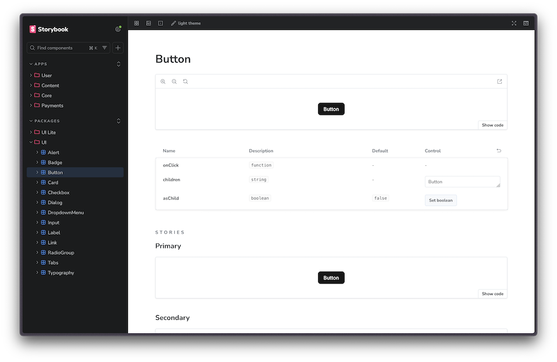

import { FileTree } from '@astrojs/starlight/components';

Develop and document UI components in isolation with **[Storybook](https://storybook.js.org/)**. Pre-configured for React with TailwindCSS, dark mode, and automatic documentation.

**Key features**

- Isolated component development
- Built-in TanStack Router and TanStack Start server-function mocking
- Interactive controls for props
- Automatic documentation generation
- Dark/light mode toggle
- Hot reloading

## Running Storybook

```bash
bun run storybook
```

Opens Storybook at [localhost:6006](http://localhost:6006) where you can browse all components.



## Writing Stories

Stories define the different states and variations of a component. They're co-located with their components:

<FileTree>

- component-name/
  - component-name.tsx Component implementation
  - component-name.stories.tsx Storybook stories
  - component-name.test.tsx Tests
  - index.ts Public exports

</FileTree>

**Basic story structure:**

```tsx
import type { Meta, StoryObj } from "@storybook/tanstack-react"
import { Button } from "./button"

const meta = {
  title: "Packages/UI/Button",
  component: Button,
  parameters: {
    layout: "centered",
  },
  tags: ["autodocs"],
} satisfies Meta<typeof Button>

export default meta
type Story = StoryObj<typeof meta>

export const Primary: Story = {
  args: {
    children: "Button",
  },
}

export const Secondary: Story = {
  args: {
    variant: "secondary",
    children: "Button",
  },
}
```

**Story organization:**

| Location | Title Prefix | Example |
|----------|--------------|---------|
| `packages/ui/` | `Packages/UI/` | `Packages/UI/Button` |
| `packages/ui-lite/` | `Packages/UI-Lite/` | `Packages/UI-Lite/Dialog` |
| `apps/*/components/` | `Apps/ModuleName/` | `Apps/Brand/Hero` |

## TanStack Router in Stories

`@storybook/tanstack-react` wraps every story in an in-memory TanStack Router instance. Components that use `@tanstack/react-router` primitives, such as `Link` or navigation hooks, render without a custom decorator.

For stories that need a specific route, params, or loader data, use `parameters.tanstack.router`:

```tsx
import type { Meta, StoryObj } from "@storybook/tanstack-react"
import { BlogPostsList } from "./blog-posts-list"

const meta = {
  title: "Apps/Blog/BlogPostsList",
  component: BlogPostsList,
  parameters: {
    tanstack: {
      router: {
        path: "/blog",
      },
    },
  },
} satisfies Meta<typeof BlogPostsList>

export default meta
type Story = StoryObj<typeof meta>

export const Default: Story = {
  args: {
    posts: [/* ... */],
  },
}
```

To render a TanStack Route object as the story component, pass it via `parameters.tanstack.router.route` and set `params`, `query`, or `routeOverrides` as needed. See the [Storybook TanStack React docs](https://storybook.js.org/docs/get-started/frameworks/tanstack-react) for the full API.

## Generating Components

Use the `create-component` skill to scaffold new components with stories. In AI Agent chat, type `/create-component` or ask to add a component in `packages/ui` or `apps/{feature}/components/`.

This creates:

- `packages/ui/my-component/my-component.tsx` - Component
- `packages/ui/my-component/my-component.stories.tsx` - Stories
- `packages/ui/my-component/my-component.test.tsx` - Tests
- `packages/ui/my-component/index.ts` - Exports

## Testing with Mock Data

Use [Faker.js](https://fakerjs.dev/) (pre-installed) to generate realistic mock data in stories:

```tsx
import { faker } from "@faker-js/faker"

export const Default: Story = {
  args: {
    title: faker.lorem.sentence({ min: 4, max: 6 }),
    description: faker.lorem.paragraph(3),
    email: faker.internet.email(),
  },
}
```
